# Digital TaskOps - Fullstack Architecture Document

**Version:** 1.0
**Date:** 2026-02-18
**Author:** Aria (Architect)
**Status:** IN PROGRESS

---

## Table of Contents

1. [Introduction](#introduction)
2. [High Level Architecture](#high-level-architecture)
3. [Tech Stack](#tech-stack)
4. [Data Models](#data-models)
5. [API Specification](#api-specification)
6. [Authentication Architecture](#authentication-architecture)
7. [Frontend Architecture](#frontend-architecture)
8. [Backend Architecture](#backend-architecture)
9. [Security & Performance](#security-performance)
10. [Deployment Architecture](#deployment-architecture)

---

## Introduction

This document outlines the complete fullstack architecture for **Digital TaskOps**, an AI-orchestrated task management system designed for digital marketing teams. It serves as the single source of truth for all development, ensuring consistency across the entire technology stack.

### Project Context

Digital TaskOps is an internal task management application for teams working in marketing, e-commerce, and marketplace operations. The system emphasizes:
- **Evidence-based execution** (screenshots/links required for all tasks)
- **Quality assurance gates** (mandatory QA approval)
- **Audit trail** (complete historical record)
- **Team collaboration** (RBAC with Admin, Head, Executor, QA roles)

### Starter Template

**Status:** N/A - Greenfield Next.js project with Supabase backend

This project is being built from scratch using industry-standard templates and frameworks, with no dependency on existing codebases.

### Change Log

| Date | Version | Description | Author |
|------|---------|-------------|--------|
| 2026-02-18 | 1.0 | Initial architecture document - Auth focus | Aria |

---

## High Level Architecture

### Technical Summary

Digital TaskOps is a modern **JAMstack application** built with **Next.js 14** (full-stack framework) and **Supabase** (PostgreSQL + Auth + Storage). The architecture emphasizes:

1. **Frontend-first UI:** React 19 with TypeScript, leveraging Next.js for server-side rendering and API routes
2. **Serverless backend:** Next.js API routes with Supabase database and real-time subscriptions
3. **Authentication:** NextAuth.js integrated with Supabase Auth for SSO and JWT management
4. **File storage:** Supabase Storage for task evidence (images, documents)
5. **Real-time collaboration:** Supabase Realtime for live updates across team members
6. **Type safety:** Full TypeScript stack from database to UI

This architecture achieves PRD goals through:
- **Quick iteration:** Single codebase, unified deployment
- **Scalability:** Serverless backend scales automatically with demand
- **Security:** RBAC policies enforced at database level (Supabase RLS)
- **Audit trail:** Database triggers log all changes automatically
- **Cost efficiency:** Pay-per-use pricing for compute and storage

### Platform and Infrastructure Choice

**Selected Platform:** Vercel + Supabase

**Rationale:**
- **Vercel:** Optimized for Next.js, automatic deployments from Git, built-in analytics
- **Supabase:** Open-source PostgreSQL with Auth, Storage, Realtime - minimal ops overhead

**Key Services:**
- `vercel.com` - Frontend hosting and Next.js API deployment
- `supabase.io` - PostgreSQL database, Auth, Storage, Realtime
- `github.com` - Git repository and CI/CD workflows

**Deployment Regions:**
- Primary: `us-east-1` (default for Vercel and Supabase)
- Backup: Configure multi-region if needed at Scale Phase 2

### Repository Structure

**Structure:** Single monorepo (Next.js app directory)

**Rationale:**
- Single `Next.js` project is simpler than monorepo tools for this scale
- All code (frontend + API routes) in one repository
- Shared types via TypeScript interfaces
- Easy to scale to monorepo (pnpm workspaces) in future if needed

**Directory Organization:**
```
digital-taskops/
├── app/                          # Next.js app directory
│   ├── (auth)/                   # Auth pages layout group
│   │   ├── login/page.tsx
│   │   ├── signup/page.tsx
│   │   └── reset-password/page.tsx
│   ├── (dashboard)/              # Protected dashboard layout group
│   │   ├── dashboard/page.tsx
│   │   ├── tasks/page.tsx
│   │   ├── tasks/[id]/page.tsx
│   │   ├── team/page.tsx
│   │   └── settings/page.tsx
│   ├── api/                      # API routes (backend)
│   │   ├── auth/[...nextauth]/route.ts
│   │   ├── tasks/route.ts
│   │   ├── tasks/[id]/route.ts
│   │   ├── evidence/route.ts
│   │   └── qa/route.ts
│   └── layout.tsx                # Root layout
├── components/                   # Shared UI components
│   ├── ui/                       # Primitive components (Button, Card, etc.)
│   ├── layout/                   # Layout components (Header, Sidebar, etc.)
│   ├── dashboard/                # Dashboard-specific components
│   └── forms/                    # Form components
├── lib/                          # Utilities and helpers
│   ├── supabase.ts              # Supabase client setup
│   ├── auth.ts                  # Auth utilities
│   ├── types.ts                 # Shared TypeScript types
│   └── constants.ts             # App constants
├── public/                       # Static assets
├── styles/                       # Global styles
├── middleware.ts                 # Next.js middleware
├── .env.example                  # Environment template
├── .env.local                    # Local environment (git-ignored)
└── package.json
```

### High Level Architecture Diagram

```mermaid
graph TB
    User["👤 User/Browser"]
    CDN["🌐 Vercel CDN"]
    NextJS["⚙️ Next.js App<br/>(API Routes)"]
    Supabase["🗄️ Supabase<br/>(PostgreSQL + Auth)"]
    Storage["📦 Supabase Storage<br/>(Evidence Files)"]
    Realtime["⚡ Realtime Subscriptions"]

    User -->|HTTPS| CDN
    CDN -->|Cached Static| CDN
    CDN -->|Route to| NextJS
    NextJS -->|Query/Insert| Supabase
    NextJS -->|Upload/Download| Storage
    Supabase -->|Subscribe| Realtime
    Realtime -->|Push Updates| User

    style User fill:#e1f5ff
    style CDN fill:#fff3e0
    style NextJS fill:#f3e5f5
    style Supabase fill:#e8f5e9
    style Storage fill:#fce4ec
    style Realtime fill:#f1f8e9
```



### Architectural Patterns

1. **JAMstack (JavaScript, APIs, Markup):** Decoupled frontend and backend communicate via REST APIs, enabling independent scaling and deployment

2. **API Routes Pattern:** Next.js API routes serve as thin backend layer between frontend and database, keeping complexity low

3. **Row-Level Security (RLS):** Supabase RLS policies enforce access control at database level - no business logic in API routes needed

4. **Repository Pattern:** Data access abstracted through utility functions (e.g., `getTasksByUser`, `createTask`), enabling testability and future DB migration

5. **Real-time Subscriptions:** Supabase Realtime allows live updates without polling - critical for collaborative features

6. **Authentication Token Flow:** NextAuth.js manages JWT tokens from Supabase, handles refresh/expiration, provides unified auth context to frontend

7. **Component-Based UI:** React components organized by feature and hierarchy, enabling code reuse and maintainability

8. **RBAC (Role-Based Access Control):** Four roles (Admin, Head, Executor, QA) with different permissions enforced via RLS policies and frontend route protection

---

## Tech Stack

| Category | Technology | Version | Purpose | Rationale |
|----------|-----------|---------|---------|-----------|
| **Frontend Language** | TypeScript | 5.x | Type-safe development | Catch errors early, better IDE support |
| **Frontend Framework** | Next.js | 14.x | Full-stack React framework | Built-in API routes, SSR, deployment optimized |
| **UI Component Library** | shadcn/ui | Latest | Pre-built accessible components | Customizable, Tailwind-based, no dependency hell |
| **Styling** | Tailwind CSS | 3.x | Utility-first CSS | Fast development, consistent design system |
| **State Management** | TanStack Query (React Query) | 5.x | Server state management | Automatic caching, background sync, mutations |
| **Form Handling** | React Hook Form | 7.x | Efficient form state | Minimal re-renders, validation integration |
| **Real-time Updates** | Supabase Realtime | Built-in | Subscribe to DB changes | Live collaboration without polling |
| **Backend Framework** | Next.js API Routes | 14.x | Serverless API layer | No separate backend server needed |
| **Database** | PostgreSQL via Supabase | 14.x | Primary data store | ACID compliance, RLS, full-text search |
| **Authentication** | NextAuth.js + Supabase Auth | v5 | Session and JWT management | Unified auth context, social login ready |
| **File Storage** | Supabase Storage | Built-in | Store evidence files | Integrated with Supabase, CDN-backed |
| **Frontend Testing** | Vitest + React Testing Library | Latest | Component and integration tests | Fast unit tests, accessibility testing |
| **Backend Testing** | Vitest | Latest | API route testing | Consistent testing framework across stack |
| **E2E Testing** | Playwright | Latest | Full user journey tests | Cross-browser automation, visual comparison |
| **Build Tool** | Next.js | Built-in | Optimize and bundle code | Zero-config, webpack under the hood |
| **Package Manager** | pnpm | Latest | Fast, disk-efficient | Better monorepo support for future scaling |
| **CI/CD** | GitHub Actions | Built-in | Automated testing and deployment | Native integration, free tier sufficient |
| **Monitoring** | Vercel Analytics + Sentry | Latest | Performance and error tracking | Real-time visibility into production issues |
| **Logging** | Pino + Supabase Logs | Latest | Structured logging | JSON logs, queryable in Supabase console |

---

## Data Models

### Core Entities

#### User (from Supabase Auth)
**Purpose:** Represent system users with RBAC support

**Key Attributes:**
- `id` (UUID) - Primary key from Supabase Auth
- `email` (string) - Unique email for login
- `role` (enum: admin|head|executor|qa) - Determines permissions
- `name` (string) - Display name
- `avatar_url` (string) - Profile picture URL
- `created_at` (timestamp) - Account creation date
- `updated_at` (timestamp) - Last profile update

**TypeScript Interface:**
```typescript
interface User {
  id: string;  // UUID from auth.users
  email: string;
  role: 'admin' | 'head' | 'executor' | 'qa';
  name: string;
  avatar_url?: string;
  created_at: string;
  updated_at: string;
}
```

**Relationships:**
- One-to-many with Task (user can create/own multiple tasks)
- One-to-many with TimeLog (user can have multiple time logs)
- One-to-many with Evidence (user can submit multiple evidences)

---

#### Task
**Purpose:** Represent a unit of work with status tracking and evidence requirements

**Key Attributes:**
- `id` (UUID) - Primary key
- `title` (string) - Task name
- `description` (text) - Full task details
- `status` (enum) - Current stage: a_fazer | fazendo | enviado_qa | aprovado | concluido
- `priority` (enum) - high | medium | low
- `assigned_to` (UUID FK) - Executor responsible
- `created_by` (UUID FK) - User who created task
- `due_date` (date) - Deadline
- `due_time` (time) - Time component of deadline
- `frente` (string) - Front/team (Conteúdo, Ads, Marketplace, etc.)
- `created_at` (timestamp)
- `updated_at` (timestamp)
- `completed_at` (timestamp) - When marked complete

**TypeScript Interface:**
```typescript
interface Task {
  id: string;
  title: string;
  description: string;
  status: 'a_fazer' | 'fazendo' | 'enviado_qa' | 'aprovado' | 'concluido';
  priority: 'high' | 'medium' | 'low';
  assigned_to: string;  // FK User.id
  created_by: string;   // FK User.id
  due_date: string;     // YYYY-MM-DD
  due_time: string;     // HH:MM
  frente: string;
  created_at: string;
  updated_at: string;
  completed_at?: string;
}
```

**Relationships:**
- Many-to-one with User (assigned_to, created_by)
- One-to-many with Evidence
- One-to-many with QAReview
- One-to-many with AuditLog

---

#### Evidence
**Purpose:** Proof of task execution (screenshot or link)

**Key Attributes:**
- `id` (UUID) - Primary key
- `task_id` (UUID FK) - Associated task
- `submitted_by` (UUID FK) - User who submitted
- `evidence_type` (enum) - file | link
- `file_url` (string) - Path in Supabase Storage (if type=file)
- `link_url` (string) - External URL (if type=link)
- `comment` (text) - Executor's comment on deliverable
- `submitted_at` (timestamp) - When evidence was added

**TypeScript Interface:**
```typescript
interface Evidence {
  id: string;
  task_id: string;  // FK Task.id
  submitted_by: string;  // FK User.id
  evidence_type: 'file' | 'link';
  file_url?: string;
  link_url?: string;
  comment: string;
  submitted_at: string;
}
```

**Relationships:**
- Many-to-one with Task
- Many-to-one with User

---

#### QAReview
**Purpose:** QA approval/rejection decisions with audit trail

**Key Attributes:**
- `id` (UUID) - Primary key
- `task_id` (UUID FK) - Task being reviewed
- `reviewed_by` (UUID FK) - QA person who decided
- `status` (enum) - aprovado | reprovado
- `reason` (text) - Required if reprovado; explanation if aprovado
- `reviewed_at` (timestamp)

**TypeScript Interface:**
```typescript
interface QAReview {
  id: string;
  task_id: string;  // FK Task.id
  reviewed_by: string;  // FK User.id
  status: 'aprovado' | 'reprovado';
  reason: string;
  reviewed_at: string;
}
```

**Relationships:**
- Many-to-one with Task
- Many-to-one with User

---

#### TimeLog (Optional for MVP, included in PRD V1)
**Purpose:** Track time spent on tasks for analytics

**Key Attributes:**
- `id` (UUID)
- `task_id` (UUID FK)
- `user_id` (UUID FK)
- `duration_minutes` (integer)
- `logged_at` (timestamp)

---

#### AuditLog
**Purpose:** Complete historical record of all changes

**Key Attributes:**
- `id` (UUID)
- `entity_type` (string) - "task" | "evidence" | "qa_review"
- `entity_id` (UUID) - ID of changed entity
- `action` (string) - "created" | "updated" | "deleted" | "status_changed"
- `changed_by` (UUID FK)
- `old_values` (jsonb) - Previous state
- `new_values` (jsonb) - New state
- `changed_at` (timestamp)

---

## API Specification

### REST API Overview

All API routes are implemented as Next.js API routes under `/api/`. Each endpoint requires authentication (via JWT token in `Authorization: Bearer` header) unless otherwise noted.

**Base URL:** `https://digital-taskops.vercel.app/api` (production)

**Authentication Header:**
```
Authorization: Bearer <JWT_TOKEN>
```

### Core API Endpoints

#### Authentication Endpoints

##### POST /api/auth/login
**Purpose:** User login (handled by NextAuth.js)

**Request:**
```json
{
  "email": "user@example.com",
  "password": "securePassword123"
}
```

**Response:** Sets `next-auth.session-token` cookie

**Status Codes:** 200 OK | 401 Unauthorized | 400 Bad Request

---

##### POST /api/auth/logout
**Purpose:** User logout

**Response:** Clears session cookie

---

#### Task Endpoints

##### GET /api/tasks
**Purpose:** Fetch all tasks visible to user (filtered by RLS)

**Query Parameters:**
- `status` (optional): Filter by task status
- `assigned_to` (optional): Filter by assignee
- `frente` (optional): Filter by team

**Response:**
```json
{
  "tasks": [
    {
      "id": "uuid",
      "title": "Create landing page mockup",
      "status": "fazendo",
      "priority": "high",
      "due_date": "2026-02-20",
      "assigned_to": "user-uuid",
      "...": "..."
    }
  ]
}
```

**Status Codes:** 200 OK | 401 Unauthorized | 403 Forbidden

---

##### POST /api/tasks
**Purpose:** Create new task (Admin/Head only)

**Request:**
```json
{
  "title": "Create landing page mockup",
  "description": "Design and implement...",
  "priority": "high",
  "assigned_to": "executor-uuid",
  "due_date": "2026-02-20",
  "due_time": "17:00",
  "frente": "Conteúdo"
}
```

**Response:**
```json
{
  "id": "new-task-uuid",
  "title": "Create landing page mockup",
  "status": "a_fazer",
  "created_at": "2026-02-18T10:30:00Z"
}
```

**Status Codes:** 201 Created | 400 Bad Request | 401 Unauthorized | 403 Forbidden

---

##### GET /api/tasks/[id]
**Purpose:** Fetch single task with related evidence and QA reviews

**Response:**
```json
{
  "task": {
    "id": "uuid",
    "title": "...",
    "description": "...",
    "evidence": [
      {
        "id": "uuid",
        "file_url": "...",
        "submitted_by": "user-uuid",
        "submitted_at": "2026-02-18T15:30:00Z"
      }
    ],
    "qa_reviews": [
      {
        "id": "uuid",
        "status": "reprovado",
        "reason": "Image quality too low",
        "reviewed_by": "qa-user-uuid",
        "reviewed_at": "2026-02-18T16:00:00Z"
      }
    ]
  }
}
```

---

##### PUT /api/tasks/[id]
**Purpose:** Update task (Creator/Admin only, or status transitions)

**Request:**
```json
{
  "status": "enviado_qa",
  "title": "Updated title (optional)"
}
```

---

##### DELETE /api/tasks/[id]
**Purpose:** Delete task (Admin only)

**Status Codes:** 204 No Content | 403 Forbidden

---

#### Evidence Endpoints

##### POST /api/evidence
**Purpose:** Submit evidence for task (Executor only)

**Request:** FormData with file or JSON with link
```
POST /api/evidence
Content-Type: multipart/form-data

task_id=uuid
evidence_type=file
file=<binary_data>
comment=Completed as requested
```

**Response:**
```json
{
  "id": "evidence-uuid",
  "file_url": "evidence/task-uuid/filename.png",
  "submitted_at": "2026-02-18T15:30:00Z"
}
```

---

#### QA Review Endpoints

##### POST /api/qa
**Purpose:** Submit QA review (QA role only)

**Request:**
```json
{
  "task_id": "uuid",
  "status": "aprovado",
  "reason": "Perfect! Matches all requirements."
}
```

---

### Error Response Format

All errors follow this standard format:

```json
{
  "error": {
    "code": "INVALID_TASK_STATUS",
    "message": "Cannot move task to invalid status",
    "details": {
      "current_status": "a_fazer",
      "requested_status": "invalid_status"
    },
    "timestamp": "2026-02-18T10:30:00Z",
    "requestId": "req-12345"
  }
}
```

**Common Error Codes:**
- `UNAUTHORIZED` - User not authenticated
- `FORBIDDEN` - User lacks permission for action
- `INVALID_REQUEST` - Malformed request body
- `NOT_FOUND` - Resource doesn't exist
- `CONFLICT` - Resource state conflict (e.g., can't approve already-approved task)
- `INTERNAL_ERROR` - Unexpected server error

---

## Authentication Architecture

This is the **core of Story 1.2**. Authentication is the foundation for RBAC and audit trail.

### Authentication Flow

```mermaid
sequenceDiagram
    participant User as 👤 User<br/>(Browser)
    participant NextApp as ⚙️ Next.js App
    participant NextAuth as 🔐 NextAuth.js
    participant SupabaseAuth as 🔑 Supabase Auth
    participant Database as 🗄️ PostgreSQL

    User->>NextApp: 1. Visit /login
    NextApp->>NextApp: Render login form
    User->>NextApp: 2. Submit email + password
    NextApp->>NextAuth: 3. Credentials provider
    NextAuth->>SupabaseAuth: 4. Authenticate user
    SupabaseAuth->>SupabaseAuth: 5. Hash password compare
    SupabaseAuth-->>NextAuth: 6. JWT token (valid)
    NextAuth->>Database: 7. Query user profile + role
    Database-->>NextAuth: 8. User data (name, role, etc.)
    NextAuth->>NextApp: 9. Create session (JWT)
    NextApp->>User: 10. Set secure cookie<br/>Redirect to /dashboard

    User->>NextApp: 11. API request<br/>(GET /api/tasks)
    NextApp->>NextApp: 12. Extract token from cookie
    NextApp->>SupabaseAuth: 13. Verify JWT signature
    SupabaseAuth-->>NextApp: 14. Token valid
    NextApp->>Database: 15. Query with RLS<br/>(enforce user permissions)
    Database-->>NextApp: 16. Data (filtered by RLS)
    NextApp-->>User: 17. Response (200 + data)
```



### Implementation Details

#### 1. NextAuth.js + Supabase Integration

**Setup in `/app/api/auth/[...nextauth]/route.ts`:**

```typescript
import NextAuth from 'next-auth';
import CredentialsProvider from 'next-auth/providers/credentials';
import { supabaseAdmin } from '@/lib/supabase';

export const authOptions = {
  providers: [
    CredentialsProvider({
      async authorize(credentials) {
        const { email, password } = credentials as {
          email: string;
          password: string;
        };

        // 1. Authenticate with Supabase
        const { data, error } = await supabaseAdmin.auth.signInWithPassword({
          email,
          password,
        });

        if (error || !data.user) {
          throw new Error('Invalid credentials');
        }

        // 2. Fetch user profile (role, name, etc.)
        const { data: profile } = await supabaseAdmin
          .from('users')
          .select('id, email, role, name, avatar_url')
          .eq('id', data.user.id)
          .single();

        return {
          id: data.user.id,
          email: data.user.email,
          role: profile?.role || 'executor',
          name: profile?.name,
          image: profile?.avatar_url,
          accessToken: data.session.access_token,
          refreshToken: data.session.refresh_token,
        };
      },
    }),
  ],

  callbacks: {
    // Add tokens to JWT
    async jwt({ token, user, account }) {
      if (user) {
        token.sub = user.id;
        token.role = user.role;
        token.accessToken = user.accessToken;
        token.refreshToken = user.refreshToken;
      }
      return token;
    },

    // Add tokens to session
    async session({ session, token }) {
      if (session.user) {
        session.user.id = token.sub;
        session.user.role = token.role as string;
        session.accessToken = token.accessToken as string;
      }
      return session;
    },
  },

  pages: {
    signIn: '/login',
    error: '/login',
  },

  session: {
    strategy: 'jwt',
    maxAge: 24 * 60 * 60, // 24 hours
  },

  secret: process.env.NEXTAUTH_SECRET,
};

export default NextAuth(authOptions);
```

#### 2. JWT Token Management

**Token Structure:**
```json
{
  "sub": "user-uuid",
  "email": "user@example.com",
  "role": "head",
  "name": "João Silva",
  "iat": 1708255200,
  "exp": 1708341600,
  "iss": "https://supabase-project.supabase.co"
}
```

**Token Lifecycle:**
1. **Issued:** 24-hour validity from Supabase Auth
2. **Storage:** Secure HTTPOnly cookie (managed by NextAuth)
3. **Refresh:** Automatic via refresh token (transparent to user)
4. **Verification:** Every API request validates JWT signature against Supabase public key

#### 3. Row-Level Security (RLS) Policies

**RLS enforces permissions at database level** - API routes don't need business logic for access control.

**Example RLS Policy on `tasks` table:**

```sql
-- Allow users to see tasks assigned to them
CREATE POLICY "Users see assigned tasks"
ON tasks
FOR SELECT
USING (assigned_to = auth.uid());

-- Allow Heads to see all tasks they created or assigned
CREATE POLICY "Heads see created and assigned"
ON tasks
FOR SELECT
USING (
  created_by = auth.uid()
  OR (
    auth.jwt()->>'role' = 'head'
    AND assigned_to = auth.uid()
  )
);

-- Allow Admins to see everything
CREATE POLICY "Admins see all"
ON tasks
FOR SELECT
USING (auth.jwt()->>'role' = 'admin');

-- Only task creator and admins can update
CREATE POLICY "Update own tasks"
ON tasks
FOR UPDATE
USING (created_by = auth.uid() OR auth.jwt()->>'role' = 'admin');
```

#### 4. Protected Routes (Frontend)

**Middleware to protect API routes:**

```typescript
// /middleware.ts
import { getToken } from 'next-auth/jwt';
import { NextRequest, NextResponse } from 'next/server';

const protectedPaths = ['/dashboard', '/team', '/settings'];

export async function middleware(request: NextRequest) {
  const token = await getToken({ req: request });

  // Redirect unauthenticated users to login
  if (protectedPaths.some(path => request.nextUrl.pathname.startsWith(path))) {
    if (!token) {
      return NextResponse.redirect(new URL('/login', request.url));
    }

    // Check role-based access
    if (request.nextUrl.pathname.startsWith('/team')) {
      if (token.role !== 'admin' && token.role !== 'head') {
        return NextResponse.redirect(new URL('/dashboard', request.url));
      }
    }
  }

  return NextResponse.next();
}

export const config = {
  matcher: ['/dashboard/:path*', '/team/:path*', '/settings/:path*'],
};
```

**Frontend Route Protection (React):**

```typescript
// /app/(dashboard)/dashboard/page.tsx
import { getServerSession } from 'next-auth';
import { redirect } from 'next/navigation';

export default async function DashboardPage() {
  const session = await getServerSession();

  if (!session) {
    redirect('/login');
  }

  return (
    <div>
      <h1>Welcome, {session.user?.name}</h1>
      <p>Role: {session.user?.role}</p>
    </div>
  );
}
```

### 5. Password & Token Security

**Password Hashing:**
- Supabase Auth uses bcrypt (automatically)
- Never store passwords in custom `users` table
- All password operations go through Supabase Auth API

**Token Security:**
- JWT tokens stored in **secure HTTPOnly cookies** (can't access via JavaScript)
- Tokens signed with Supabase secret key
- Signature verified on every API request
- 24-hour expiration with automatic refresh

**Session Security:**
- CSRF protection via SameSite=Strict cookies
- Tokens rotated automatically on sensitive operations
- Logout clears all tokens and sessions

### 6. OAuth / Social Login (Future)

**Architecture supports OAuth without code changes:**

```typescript
// Add to NextAuth providers array
providers: [
  // ... CredentialsProvider
  GoogleProvider({
    clientId: process.env.GOOGLE_CLIENT_ID,
    clientSecret: process.env.GOOGLE_CLIENT_SECRET,
  }),
  GitHubProvider({
    clientId: process.env.GITHUB_CLIENT_ID,
    clientSecret: process.env.GITHUB_CLIENT_SECRET,
  }),
],

callbacks: {
  async signIn({ user, account, profile }) {
    // First time OAuth login: create user profile
    const { data: existingUser } = await supabaseAdmin
      .from('users')
      .select()
      .eq('email', user.email)
      .single();

    if (!existingUser) {
      // Create new user profile
      await supabaseAdmin.from('users').insert({
        id: user.id,
        email: user.email,
        name: user.name,
        avatar_url: user.image,
        role: 'executor',
      });
    }

    return true;
  },
},
```

### 7. Two-Factor Authentication (Roadmap for Phase 2)

**Architecture supports 2FA via Supabase:**

```typescript
// Supabase supports TOTP out of box
// POST /auth/v1/factors - Create 2FA factor
// POST /auth/v1/factors/{id}/challenge - Start 2FA challenge
// POST /auth/v1/factors/{id}/verify - Verify TOTP code

// Phase 1 (current): Username/password only
// Phase 2: Add 2FA during onboarding
// Phase 3: Require 2FA for Admin role
```

### 8. Rate Limiting (Security)

**API route rate limiting:**

```typescript
// /lib/rateLimit.ts
import { Ratelimit } from '@upstash/ratelimit';
import { Redis } from '@upstash/redis';

const ratelimit = new Ratelimit({
  redis: Redis.fromEnv(),
  limiter: Ratelimit.slidingWindow(100, '1 h'), // 100 requests per hour
});

// Use in API routes
export async function POST(request: Request) {
  const { success } = await ratelimit.limit('global');

  if (!success) {
    return new Response('Too many requests', { status: 429 });
  }

  // ... handle request
}
```

---

## Frontend Architecture

### Component Organization

```
components/
├── ui/                      # Reusable primitive components
│   ├── Button.tsx
│   ├── Card.tsx
│   ├── Input.tsx
│   ├── Modal.tsx
│   ├── Tabs.tsx
│   └── ...
├── layout/                  # Layout components
│   ├── Header.tsx           # Top navigation
│   ├── Sidebar.tsx          # Left navigation
│   ├── Footer.tsx
│   └── MainLayout.tsx
├── dashboard/               # Dashboard-specific
│   ├── TaskCard.tsx
│   ├── TaskStatusBadge.tsx
│   ├── DashboardStats.tsx
│   └── DashboardFilters.tsx
├── forms/                   # Form components
│   ├── LoginForm.tsx
│   ├── CreateTaskForm.tsx
│   ├── EvidenceUploadForm.tsx
│   └── QAReviewForm.tsx
└── common/                  # Shared complex components
    ├── AuthGuard.tsx        # Protect routes
    ├── RoleGuard.tsx        # Check user role
    └── LoadingSpinner.tsx
```

### State Management

**TanStack Query (React Query)** for server state:

```typescript
// Example: Fetch tasks
import { useQuery, useMutation } from '@tanstack/react-query';

function TasksList() {
  const { data: tasks, isLoading, error } = useQuery({
    queryKey: ['tasks'],
    queryFn: async () => {
      const res = await fetch('/api/tasks');
      if (!res.ok) throw new Error('Failed to fetch');
      return res.json();
    },
  });

  const createTaskMutation = useMutation({
    mutationFn: async (newTask) => {
      const res = await fetch('/api/tasks', {
        method: 'POST',
        body: JSON.stringify(newTask),
      });
      return res.json();
    },
    onSuccess: () => {
      // Invalidate cache to refetch tasks
      queryClient.invalidateQueries({ queryKey: ['tasks'] });
    },
  });

  return (
    <div>
      {isLoading && <p>Loading...</p>}
      {error && <p>Error: {error.message}</p>}
      {tasks?.map(task => <TaskCard key={task.id} task={task} />)}
    </div>
  );
}
```

### Routing Architecture

```
app/
├── (auth)/
│   ├── login/page.tsx         # /login
│   ├── signup/page.tsx        # /signup
│   ├── reset-password/page.tsx # /reset-password
│   └── layout.tsx             # Auth layout (no sidebar)
│
├── (dashboard)/
│   ├── dashboard/page.tsx     # /dashboard (main view)
│   ├── tasks/page.tsx         # /tasks (task list)
│   ├── tasks/[id]/page.tsx    # /tasks/123 (task detail)
│   ├── team/page.tsx          # /team (admin view)
│   ├── settings/page.tsx      # /settings
│   └── layout.tsx             # Dashboard layout (with sidebar)
│
├── api/
│   ├── auth/[...nextauth]/route.ts
│   ├── tasks/route.ts
│   ├── tasks/[id]/route.ts
│   ├── evidence/route.ts
│   └── qa/route.ts
│
└── layout.tsx                 # Root layout
```

---

## Backend Architecture

### API Route Structure

All backend logic lives in `/app/api/`. Each route is a serverless function (deployed automatically by Vercel).

```typescript
// /app/api/tasks/route.ts
import { getServerSession } from 'next-auth';
import { createSupabaseServerClient } from '@/lib/supabase';
import { NextRequest, NextResponse } from 'next/server';

// GET /api/tasks - Fetch tasks
export async function GET(request: NextRequest) {
  const session = await getServerSession();

  if (!session) {
    return NextResponse.json({ error: 'Unauthorized' }, { status: 401 });
  }

  const supabase = createSupabaseServerClient();

  // RLS policies automatically filter data by user role
  const { data: tasks, error } = await supabase
    .from('tasks')
    .select('*')
    .order('due_date', { ascending: true });

  if (error) {
    return NextResponse.json(
      { error: 'Failed to fetch tasks' },
      { status: 500 }
    );
  }

  return NextResponse.json({ tasks });
}

// POST /api/tasks - Create task
export async function POST(request: NextRequest) {
  const session = await getServerSession();

  if (!session || !['admin', 'head'].includes(session.user?.role)) {
    return NextResponse.json({ error: 'Forbidden' }, { status: 403 });
  }

  const body = await request.json();
  const supabase = createSupabaseServerClient();

  const { data: newTask, error } = await supabase
    .from('tasks')
    .insert([
      {
        ...body,
        created_by: session.user.id,
        status: 'a_fazer',
      },
    ])
    .select()
    .single();

  if (error) {
    return NextResponse.json({ error: error.message }, { status: 400 });
  }

  return NextResponse.json(newTask, { status: 201 });
}
```

### Database Schema (SQL)

```sql
-- Enable extensions
CREATE EXTENSION IF NOT EXISTS "uuid-ossp";

-- Users table (extends Supabase Auth)
CREATE TABLE public.users (
  id UUID PRIMARY KEY REFERENCES auth.users(id) ON DELETE CASCADE,
  email VARCHAR(255) UNIQUE NOT NULL,
  role VARCHAR(20) NOT NULL CHECK (role IN ('admin', 'head', 'executor', 'qa')),
  name VARCHAR(255),
  avatar_url TEXT,
  created_at TIMESTAMP DEFAULT NOW(),
  updated_at TIMESTAMP DEFAULT NOW()
);

-- Tasks table
CREATE TABLE public.tasks (
  id UUID PRIMARY KEY DEFAULT uuid_generate_v4(),
  title VARCHAR(255) NOT NULL,
  description TEXT,
  status VARCHAR(50) NOT NULL DEFAULT 'a_fazer'
    CHECK (status IN ('a_fazer', 'fazendo', 'enviado_qa', 'aprovado', 'concluido')),
  priority VARCHAR(20) NOT NULL DEFAULT 'medium'
    CHECK (priority IN ('high', 'medium', 'low')),
  assigned_to UUID NOT NULL REFERENCES users(id),
  created_by UUID NOT NULL REFERENCES users(id),
  due_date DATE NOT NULL,
  due_time TIME,
  frente VARCHAR(100),
  created_at TIMESTAMP DEFAULT NOW(),
  updated_at TIMESTAMP DEFAULT NOW(),
  completed_at TIMESTAMP
);

-- Evidence table
CREATE TABLE public.evidence (
  id UUID PRIMARY KEY DEFAULT uuid_generate_v4(),
  task_id UUID NOT NULL REFERENCES tasks(id) ON DELETE CASCADE,
  submitted_by UUID NOT NULL REFERENCES users(id),
  evidence_type VARCHAR(20) NOT NULL CHECK (evidence_type IN ('file', 'link')),
  file_url TEXT,
  link_url TEXT,
  comment TEXT,
  submitted_at TIMESTAMP DEFAULT NOW()
);

-- QA Reviews table
CREATE TABLE public.qa_reviews (
  id UUID PRIMARY KEY DEFAULT uuid_generate_v4(),
  task_id UUID NOT NULL REFERENCES tasks(id) ON DELETE CASCADE,
  reviewed_by UUID NOT NULL REFERENCES users(id),
  status VARCHAR(50) NOT NULL CHECK (status IN ('aprovado', 'reprovado')),
  reason TEXT,
  reviewed_at TIMESTAMP DEFAULT NOW()
);

-- Audit log table
CREATE TABLE public.audit_logs (
  id UUID PRIMARY KEY DEFAULT uuid_generate_v4(),
  entity_type VARCHAR(50),
  entity_id UUID,
  action VARCHAR(50),
  changed_by UUID REFERENCES users(id),
  old_values JSONB,
  new_values JSONB,
  changed_at TIMESTAMP DEFAULT NOW()
);

-- Enable RLS
ALTER TABLE users ENABLE ROW LEVEL SECURITY;
ALTER TABLE tasks ENABLE ROW LEVEL SECURITY;
ALTER TABLE evidence ENABLE ROW LEVEL SECURITY;
ALTER TABLE qa_reviews ENABLE ROW LEVEL SECURITY;
ALTER TABLE audit_logs ENABLE ROW LEVEL SECURITY;

-- RLS POLICIES for tasks table
CREATE POLICY "Admins see all tasks"
  ON tasks FOR SELECT
  USING (auth.jwt()->>'role' = 'admin');

CREATE POLICY "Heads see own created tasks"
  ON tasks FOR SELECT
  USING (created_by = auth.uid() OR auth.jwt()->>'role' = 'head');

CREATE POLICY "Executors see assigned tasks"
  ON tasks FOR SELECT
  USING (assigned_to = auth.uid());

-- RLS POLICIES for evidence table
CREATE POLICY "See evidence for visible tasks"
  ON evidence FOR SELECT
  USING (EXISTS (
    SELECT 1 FROM tasks t WHERE t.id = evidence.task_id
    AND (t.assigned_to = auth.uid() OR t.created_by = auth.uid() OR auth.jwt()->>'role' = 'admin')
  ));

-- Indexes for performance
CREATE INDEX idx_tasks_assigned_to ON tasks(assigned_to);
CREATE INDEX idx_tasks_created_by ON tasks(created_by);
CREATE INDEX idx_tasks_due_date ON tasks(due_date);
CREATE INDEX idx_tasks_status ON tasks(status);
CREATE INDEX idx_evidence_task_id ON evidence(task_id);
CREATE INDEX idx_qa_reviews_task_id ON qa_reviews(task_id);
```

---

## Security & Performance

### Security Requirements

**Frontend Security:**
- **CSP Headers:** Restrict script execution to trusted sources
- **XSS Prevention:** React auto-escapes content, sanitize user input in forms
- **Secure Storage:** JWT tokens in HTTPOnly cookies (never localStorage)

**Backend Security:**
- **Input Validation:** Validate all user inputs before DB operations
- **Rate Limiting:** Limit requests per IP/user to prevent brute force
- **CORS Policy:** Allow only frontend domain

**Authentication Security:**
- **Token Storage:** HTTPOnly, Secure, SameSite=Strict cookies
- **Session Management:** 24-hour expiration, automatic refresh
- **Password Policy:** Enforced by Supabase (min 8 chars, complexity)

**Configuration:**

```typescript
// /lib/security.ts
export const securityHeaders = {
  'Content-Security-Policy': "default-src 'self'; script-src 'self' 'unsafe-inline' vercel.live",
  'X-Content-Type-Options': 'nosniff',
  'X-Frame-Options': 'SAMEORIGIN',
  'X-XSS-Protection': '1; mode=block',
  'Referrer-Policy': 'strict-origin-when-cross-origin',
};

export const corsConfig = {
  origin: process.env.NEXT_PUBLIC_APP_URL,
  credentials: true,
  methods: ['GET', 'POST', 'PUT', 'DELETE'],
};
```

### Performance Optimization

**Frontend Performance:**
- **Bundle Size Target:** < 100KB gzipped
- **Loading Strategy:** Dynamic imports for heavy components
- **Caching Strategy:** TanStack Query auto-caches API responses

**Backend Performance:**
- **Response Time Target:** < 200ms p95
- **Database Optimization:** Indexed queries, connection pooling
- **Caching Strategy:** Cache user profile in session, short TTL on list queries

---

## Deployment Architecture

### Platform: Vercel + Supabase

**Frontend Deployment:**
- Platform: Vercel (automatic from Git)
- Build: `next build`
- Output: `.next/` directory
- CDN: Vercel Edge Network (global)

**Backend Deployment:**
- Platform: Vercel (same as frontend)
- Functions: Next.js API routes (serverless)
- No separate backend server needed

**Database Deployment:**
- Platform: Supabase (managed PostgreSQL)
- Region: `us-east-1`
- Backups: Automated daily

### CI/CD Pipeline

```yaml
# .github/workflows/deploy.yml
name: Deploy

on:
  push:
    branches: [main]
  pull_request:
    branches: [main]

jobs:
  test:
    runs-on: ubuntu-latest
    steps:
      - uses: actions/checkout@v4
      - uses: actions/setup-node@v4
        with:
          node-version: 20
      - run: pnpm install
      - run: pnpm lint
      - run: pnpm typecheck
      - run: pnpm test

  deploy:
    needs: test
    if: github.ref == 'refs/heads/main'
    runs-on: ubuntu-latest
    steps:
      - uses: actions/checkout@v4
      - uses: vercel/action@main
        with:
          vercel-token: ${{ secrets.VERCEL_TOKEN }}
          vercel-org-id: ${{ secrets.VERCEL_ORG_ID }}
          vercel-project-id: ${{ secrets.VERCEL_PROJECT_ID }}
```

### Environments

| Environment | Frontend URL | Backend URL | Purpose |
|-------------|-------------|------------|---------|
| Development | `localhost:3000` | `localhost:3000/api` | Local development |
| Staging | `staging.digital-taskops.vercel.app` | Same (staging branch) | Pre-production testing |
| Production | `digital-taskops.vercel.app` | Same | Live environment |

---

## Summary & Next Steps

✅ **Architecture Defined:**
- Full-stack Next.js + Supabase setup
- Authentication with NextAuth.js + JWT tokens
- RBAC enforced via RLS policies
- Frontend and backend components
- Security and performance considerations
- Deployment strategy

**Next Stories in Epic 1:**
1. ✅ **Story 1.2** - This authentication architecture (DONE)
2. **Story 1.1** - Database schema implementation (@data-engineer)
3. **Story 1.3** - UI/UX design (@ux-design-expert)
4. **Story 1.4** - Component export & Next.js setup (@dev)
5. **Story 1.5** - NextAuth.js integration (@dev)
6. **Story 1.6** - CI/CD pipeline setup (@devops)

**Ready for handoff to @dev for implementation!**

---

**Document Generated:** 2026-02-18
**Author:** Aria (Architect)
**Status:** REVIEW READY
